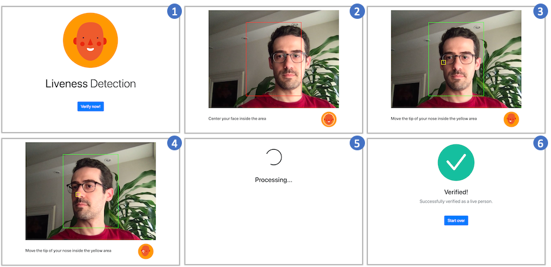
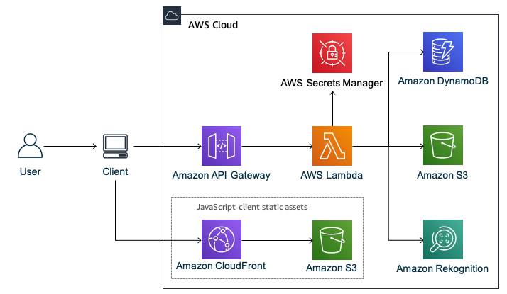

> Check the [Liveness Detection Framework](https://aws.amazon.com/solutions/implementations/liveness-detection-framework/), a solution that helps you implement liveness detection mechanisms into your applications by means of an extensible architecture. The solution is available in the AWS Solutions Implementations website and its code is available in a [GitHub repo](https://github.com/aws-solutions/liveness-detection-framework).

# Liveness Detection sample

## Note

* The solution provided here is not secure against all spoofing. Therefore, before deploying to production, thoroughly
  test it to validate if it meets your security requirements.
* The included client (JavaScript frontend web application) is not optimized for small screens and also lacks
  refinements. You should use it as a starting point or as a sample of how to implement different clients (the backend
  is client agnostic).
* The ability to properly monitor a system in production is crucial and the implemented code doesn't provide enough
  means to do so. Consider using both Amazon CloudWatch Logs and Amazon CloudWatch Metrics to have more visibility of
  all architecture components before deploying to production.

## Overview

This package includes the backend and a sample client (JavaScript frontend) of a liveness detection application.

The application asks the user to perform a challenge: the user must move the nose to a random area shown on the screen.
In the end, the following is verified: 1. there was one and only one face, 2. the user moved the nose to the target
area, and 3. the user rotated the face.

Following there are some screenshots of a user performing the challenge:



Following is the architecture of the application:



## Setup

### Prerequisites

1. Configure the AWS Credentials in your environment. Refer
   to [Configuration and credential file settings](https://docs.aws.amazon.com/cli/latest/userguide/cli-configure-files.html)
   .

2. Download and install AWS CLI. Refer
   to [Installing the AWS CLI](https://docs.aws.amazon.com/cli/latest/userguide/cli-chap-install.html).

3. Download and install AWS SAM CLI. Refer
   to [Installing the AWS SAM CLI](https://docs.aws.amazon.com/serverless-application-model/latest/developerguide/serverless-sam-cli-install.html)
   .

4. Download and install Docker. Refer to [Docker](https://www.docker.com/products/docker-desktop).

5. Download and install Node.js. Refer to [Node.js Downloads](https://nodejs.org/en/download/).

### Backend

Run the command below to deploy the backend:

```
sam build --use-container && sam deploy --guided
```

The command above creates a CloudFormation stack with the following outputs: `ApiUrl`, `StaticWebsiteUrl`,
and `StaticWebsiteBucket`. You need those values in the next steps.

### Frontend

1. Enter in the `client/` directory.

2. Download the ML models from [face-api.js library](https://github.com/justadudewhohacks/face-api.js):

 ```
 curl -o public/weights/tiny_face_detector_model-shard1.shard -kL https://github.com/justadudewhohacks/face-api.js/blob/a86f011d72124e5fb93e59d5c4ab98f699dd5c9c/weights/tiny_face_detector_model-shard1?raw=true
echo 'f3020debaf078347b5caaff4bf6dce2f379d20bc *public/weights/tiny_face_detector_model-shard1.shard' | shasum -c

curl -o public/weights/tiny_face_detector_model-weights_manifest.json -kL https://github.com/justadudewhohacks/face-api.js/blob/a86f011d72124e5fb93e59d5c4ab98f699dd5c9c/weights/tiny_face_detector_model-weights_manifest.json?raw=true
echo '1f9da0ddb847fcd512cb0511f6d6c90985d011e6 *public/weights/tiny_face_detector_model-weights_manifest.json' | shasum -c

curl -o public/weights/face_landmark_68_model-shard1.shard -kL https://github.com/justadudewhohacks/face-api.js/blob/a86f011d72124e5fb93e59d5c4ab98f699dd5c9c/weights/face_landmark_68_model-shard1?raw=true
echo 'e8b453a3ce2a66e6fa070d4e30cd4e91c911964b *public/weights/face_landmark_68_model-shard1.shard' | shasum -c

curl -o public/weights/face_landmark_68_model-weights_manifest.json -kL https://github.com/justadudewhohacks/face-api.js/blob/a86f011d72124e5fb93e59d5c4ab98f699dd5c9c/weights/face_landmark_68_model-weights_manifest.json?raw=true
echo 'a981c7adfc6366e7b51b6c83b3bb84961a9a4b15 *public/weights/face_landmark_68_model-weights_manifest.json' | shasum -c
```

3. Change the models' paths in the manifests:

 ```
 perl -i -pe 's/tiny_face_detector_model-shard1/tiny_face_detector_model-shard1.shard/g' public/weights/tiny_face_detector_model-weights_manifest.json

 perl -i -pe 's/face_landmark_68_model-shard1/face_landmark_68_model-shard1.shard/g' public/weights/face_landmark_68_model-weights_manifest.json
 ```

4. Open the `.env` file and replace the value of `VUE_APP_API_URL` with the API URL (`ApiUrl`) outputted during the
   backend deployment.

5. Run the comamand below to build the frontend:

 ```
 npm install && npm run build
 ```

6. Copy the static frontend files with the following command (replace `{YOUR_BUCKET}` with the bucket name
    - `StaticWebsiteBucket` - outputted during the backend deployment):

 ```
 aws s3 cp dist s3://{YOUR_BUCKET}/ --recursive
 ```

Open your browser and navigate to the CloudFront URL (`StaticWebsiteUrl`) outputted during the backend deployment.

## Clean up (Optional)

If you don't want to continue using the application, take the following steps to clean up its resources and avoid
further charges.

### Empty the Amazon S3 buckets

Before you can delete a bucket, you must first delete its contents.

1. Sign in to the AWS Management Console and open the Amazon S3 console
   at [https://console.aws.amazon.com/s3](https://console.aws.amazon.com/s3).

2. In the **Bucket name** list, select the option next to the *StaticWebsiteBucket* and then choose **Empty**.

3. On the **Empty bucket** page, confirm that you want to empty the bucket by entering the bucket name into the text
   field, and then choose **Empty**.

4. In the **Bucket name** list, select the option next to the *FramesBucket* and then choose **Empty**.

5. On the **Empty bucket** page, confirm that you want to empty the bucket by entering the bucket name into the text
   field, and then choose **Empty**.

### Delete the CloudFormation stack

AWS CloudFormation makes it easy to clean up resources that the stack created. When you delete the stack, all resources
that the stack created are deleted.

1. Open the AWS CloudFormation console
   at [https://console.aws.amazon.com/cloudformation](https://console.aws.amazon.com/cloudformation).

2. On the **Stacks** page in the CloudFormation console, select the stack you deployed during the Backend setup.

3. In the stack details pane, choose **Delete**.

4. Select **Delete stack** when prompted.

## Security

See [CONTRIBUTING](CONTRIBUTING.md#security-issue-notifications) for more information.

## License

This library is licensed under the MIT-0 License. See the LICENSE file.
